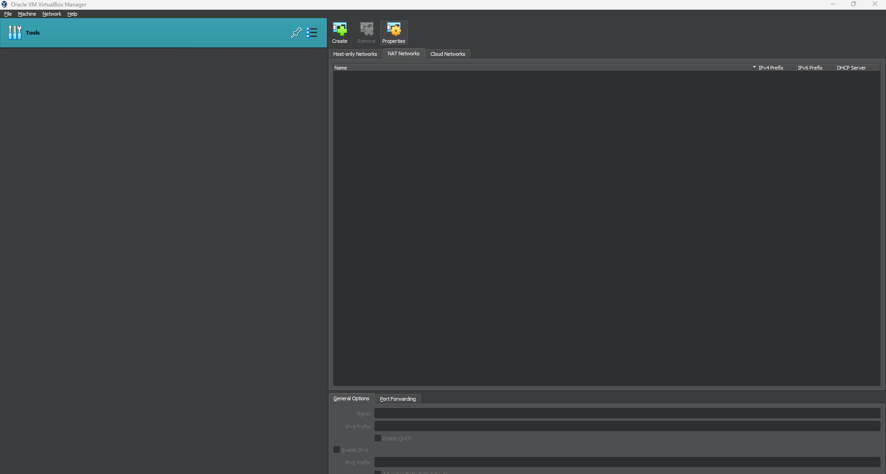
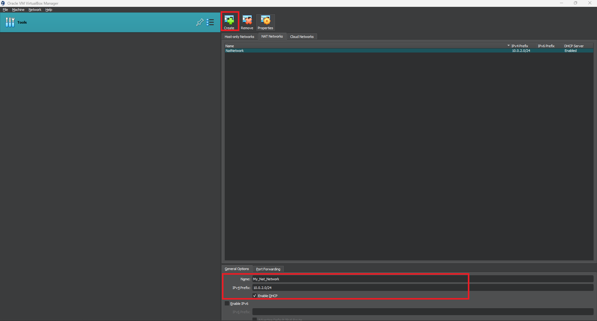
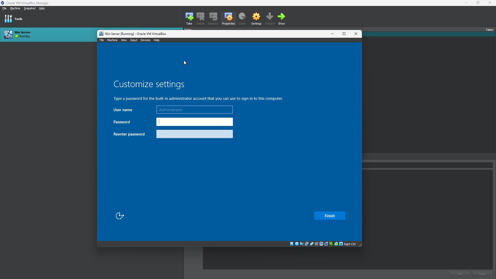

# Lab Setup, Tools & Configuration

## Lab Setup

* ### Download & Install VirtualBox for your host machine
    - Download VirtualBox Here: <a href="https://www.virtualbox.org/wiki/Downloads" target="_blank">VirtualBox Website</a>

    - Run and Complete the Installation

* ### Configure VirtualBox Network Settings
    - Launch VirtualBox and get follow the configuration steps below:

1. #### Go to File > Tools > Network Manager
    - This will help us configure Networks

        

2. #### Select the 'NAT Networks' tab on the right pane
    - Click the 'Create' button at the top to create a new Network

    - Give your Network a Name

    - ##### Set your Network CIDR: (example: 10.0.2.0/24)
        - This range will assign IPs from '10.0.2.1' to '10.0.2.254'.
    
        

3. #### Click 'Apply' at the bottom right to accept the changes

## Windows Server Setup

* ### Windows Server Download & Installation
    - ##### Download Windows Server [ISO FILE] Here: [Win 2022 Download Website](https://info.microsoft.com/ww-landing-windows-server-2022.html)

    - ***The download can take time depending on your machine's resources, so plan accordingly.***

    - Follow the installation guide below: 

        1. Setup and allocate resources for the Windows Server (Follow this VIDEO):

            https://github.com/user-attachments/assets/c2328305-2909-4e40-908b-2533b0276a92
        
        2. Install A Windows Server:
            - ##### Click Start to start the VM
            - ##### Your VM Will start the Installation. Follow this VIDEO to complete the setup:

                https://github.com/user-attachments/assets/1af57eee-7041-4f4c-a4dc-6ee86f67c17d
            

            - ##### After the installation is Complete, the Operating System will restart
               ***DO NOT PRESS ANY KEY WHEN THE MACHINE BOOTS UP***

            - ##### Complete your setup by adding a strong password:
                 
                

            - ##### Ctrl+Alt+Delete may not work to unlock if your host is a Windows Machine. Instead, on a menu bar ***Select Input > Keyboard > Insert Ctrl-Alt-Del***
                - Enter Your Password and the Desktop will launch!
                - Select YES to allow "This PC to be Discoverable".

            - ##### The Server Manager will launch automatically.
            - ##### Before we do anything further, check for any available updates and install all of those updates. This will help us work with an up-to-date and hardened Operating System.

## ***IMPORTANT*** GUEST ADDITIONS (Enabling Full Screen)
    You may have noticed that your OS is not taking on full-screen mode.
    That's because we need to insert Guest Additions CD Image. 
    The VIDEO below will show you how to do this. 
    Reboot the system when done. This will need to be done on all your VMs. 
    

https://github.com/user-attachments/assets/d883467a-ace8-47e3-911c-22f2d8c3841b

Congrats! You have installed your first VM!
            
            
